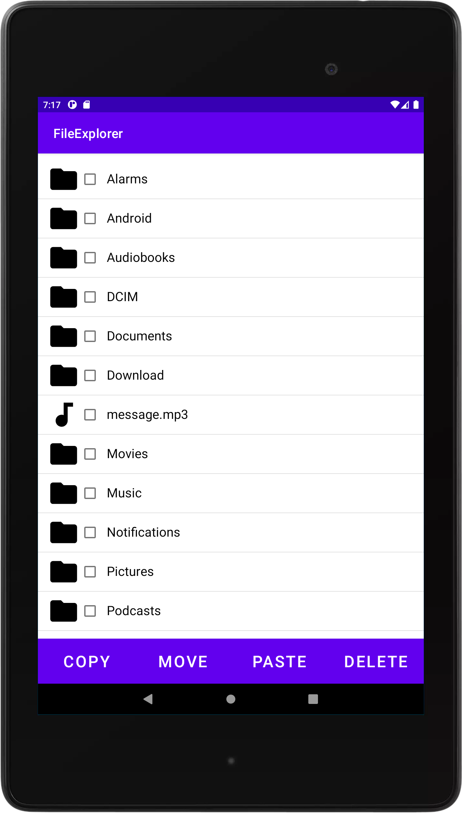

# FileExplorer
Przeglądarka plików, które pozwala otwierać, przenosić, kopiować i usuwać pliki oraz foldery. 
Aby skopiować plik, pliki bądź folder należy zazanaczy rzeczy jakie nas interesują kliknąć "COPY", a następnie przejść do docelowego folderu i kliknąć w nim "PASTE". 
Aby przenieść plik, pliki bądź folder należy zazanaczy rzeczy jakie nas interesują kliknąć "MOVE", a następnie przejść do docelowego folderu i kliknąć w nim "PASTE". 
Aby usunąć plik, pliki bądź folder należy zazanaczy rzeczy jakie nas interesują kliknąć "DELETE". 
Pliki są otwierane w innych aplikacjach. 
Tworzona w środowisku programistycznym Android Studio i testowana pod urządzeniem o rozdzielczości 1200x1920. 

